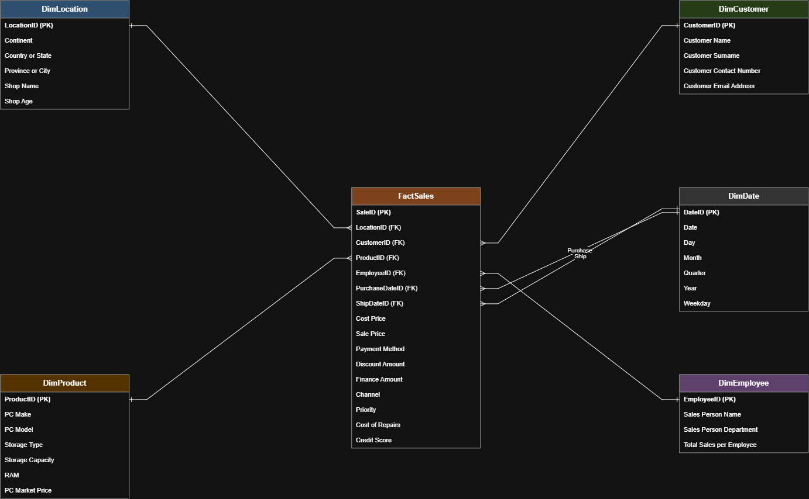

# PC-Sales-Data-Warehouse

Star schema data warehouse built from a flat PC sales dataset — a portfolio
project demonstrating the full pipeline from raw source to a query-ready
warehouse, using medallion architecture (Bronze → Silver → Gold).

## Project goal

Take a single denormalised sales sheet and design/build a dimensional
model (star schema) suitable for BI reporting.

## Tech stack

- SQL Server (T-SQL, SSMS)
- draw.io (ER / star schema modelling)
- Git/GitHub for version control

## Architecture plan (medallion)

| Layer | Purpose | Status |
|---|---|---|
| **Bronze** | Raw staging table, mirrors source file as-is | ✅ Done — `sql/01_bronze_staging.sql` |
| **Silver** | Cleaned, typed, de-duplicated data | ✅ Done — `sql/02_silver_clean.sql` |
| **Gold** | Star schema (dimensions + fact) for reporting | ✅ Done — `sql/03_gold_star_schema.sql`, `sql/04_gold_load.sql` |
| **Loading** | SSIS package for Silver → Gold | ✅ Done — `etl/ssis/PCSales_ETL/Gold_Load.dtsx`, calls stored procedures |

## Pipeline status

The data pipeline is complete end to end, from raw CSV through Bronze,
Silver, and Gold, with the Silver → Gold step now automated. Bronze and
Silver are loaded with re-runnable SQL scripts (`sql/`). The Gold load
logic lives in three stored procedures (`sql/06_gold_load_procedures.sql`)
— clear, load dimensions, load fact — orchestrated by an SSIS package
(`etl/ssis/PCSales_ETL/Gold_Load.dtsx`) that runs them in sequence. Bronze
→ Silver isn't automated yet; that's the natural next step if this needed
to run against a live, updating source.

## Star schema



One fact table (`FactSales`) with five dimensions (`DimLocation`,
`DimCustomer`, `DimProduct`, `DimEmployee`, `DimDate`) — `DimDate` is
role-played twice, for Purchase Date and Ship Date.

## Repository structure
```
PC-Sales-Data-Warehouse/
├── README.md
├── docs/
│   └── progress-log.md        # session-by-session log of decisions and debugging
├── diagrams/
│   ├── PC_Star_Schema.drawio   # editable source
│   └── PC_Star_Schema.png      # rendered preview (above)
├── sql/
│   ├── 01_bronze_staging.sql
│   └── 02_silver_clean.sql
├── etl/
│   └── ssis/                  # reserved for Silver → Gold SSIS package
└── data/                      # local-only source data (gitignored)
```